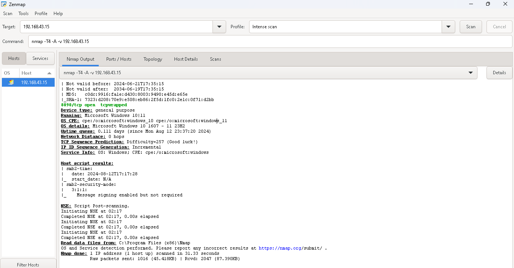
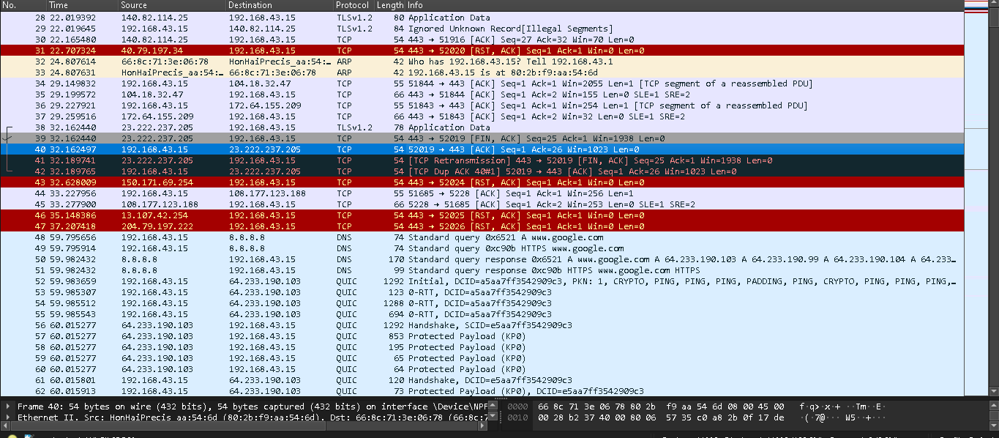

# Informe Forense de Ciberseguridad

## Portada

**Título del Informe:** Informe Forense de Ciberseguridad - Ejemplo Simulado  
**Fecha:** 2024-08-13  
**Autor:** Joel  
**Organización:** Fucap
---
.
## Resumen Ejecutivo

Este informe presenta los hallazgos del análisis forense realizado en el equipo con IP 192.168.43.15. El análisis ha identificado varios servicios activos y configuraciones básicas en el sistema en el cual esta la pagina de Marketing. No se han detectado vulnerabilidades graves, pero se han observado configuraciones que podrían ser mejoradas para optimizar la seguridad. Esto sin considerar que el dispositivo esta en uso constante y eso puede llevar a tener vulnerabilidades futuras

---

## Introducción

El propósito de este informe es proporcionar una visión general de los resultados del escaneo forense realizado en un sistema. Se enfoca en identificar servicios activos y posibles Vulnerabilidades que puedan afectar a el localhost y comprometa la seguridad de la pagina.

---

## Antecedentes del Caso

El análisis se realizó en un entorno controlado para evaluar la seguridad de un sistema en red. La IP objetivo es 192.168.43.15, que representa un servidor de prueba con varias aplicaciones instaladas.

---

## Objetivos del Análisis

1. **Identificar Servicios Activos**: Determinar qué servicios están escuchando en el host.
2. **Verificar Configuraciones de Seguridad**: Revisar las configuraciones básicas de seguridad de los servicios detectados.
3. **Evaluar Exposición de Puertos**: Identificar puertos abiertos y su posible impacto en la seguridad.

---

## Metodología

1. **Escaneo de Puertos**: Utilización de Nmap para identificar puertos abiertos y servicios activos.
2. **Análisis de Servicios**: Revisión de las versiones de servicios detectados y sus configuraciones básicas.
3. **Generación de Reporte**: Compilación de hallazgos en un informe para su revisión.

---

## Herramientas Usadas

- **Nmap**: Para escaneo de puertos y detección de servicios.
- **Wireshark**: Para captura y análisis de tráfico de red.
- **Autopsy**: Para análisis de archivos y recuperación de datos.

---

## Técnicas de Análisis

- **Escaneo SYN Stealth**: Para identificar puertos abiertos sin establecer conexiones completas.
- **Detección de Servicios**: Para obtener información sobre las versiones de los servicios detectados.
- **Revisión de Metadatos**: Para analizar configuraciones básicas y posibles debilidades.

---

## Hallazgos

### Hallazgo 1: Servicios Web Activos

- **Puerto 80/tcp**: HTTP
  - **Versión**: Apache httpd 2.4.59
  - **Detalles**: Configuración básica. La página de inicio muestra "Ejemplo Corp - Página de Marketing".

### Hallazgo 2: Servicio de Base de Datos

- **Puerto 3306/tcp**: MySQL
  - **Versión**: MySQL 8.3.0
  - **Detalles**: La configuración por defecto está activa. Se recomienda cambiar la contraseña de root y revisar los permisos.

### Hallazgo 3: Servicio de Aplicaciones

- **Puerto 3000/tcp**: Node.js Express
  - **Versión**: Framework Express
  - **Detalles**: La página de inicio muestra "Página de Marketing". La configuración es estándar sin cambios significativos.

---

## Línea de Tiempo de Hallazgos

| Fecha y Hora      | Evento/Acción           | Detalles                            |
|------------------|--------------------------|-------------------------------------|
| 2024-08-13 02:17 | Inicio del Escaneo       | Comienzo del escaneo de puertos      |
| 2024-08-13 02:17 | Escaneo Completo         | Se completó el escaneo de puertos    |
| 2024-08-13 02:18 | Análisis de Servicios    | Revisión de servicios detectados     |
| 2024-08-13 02:18 | Generación del Informe   | Compilación de hallazgos en el informe|

---

## Posibles Vectores de Ataque

- **Puerto 80/tcp**: Puede ser susceptible a ataques web comunes si no se actualiza regularmente.
- **Puerto 3306/tcp**: Posibles riesgos si las credenciales están en uso.
- **Puerto 3000/tcp**: Asegúrate de que no haya configuraciones predeterminadas expuestas en producción.

---

## Conclusiones

El escaneo ha revelado varios servicios activos en el sistema. Aunque no se han encontrado vulnerabilidades graves, algunas configuraciones podrían mejorarse para fortalecer la seguridad general del sistema.

---

## Recomendaciones

### A Corto Plazo

1. **Actualizar el Servicio Web**: Asegúrate de que el servidor web esté actualizado con los últimos parches de seguridad.
2. **Cambiar Contraseñas Predeterminadas**: Cambia las contraseñas predeterminadas de MySQL y revisa los permisos.

### A Largo Plazo

1. **Implementar Reglas de Cortafuegos**: Configura reglas de cortafuegos para limitar el acceso a puertos sensibles.
2. **Monitorear Servicios**: Implementa herramientas de monitoreo para detectar y responder a posibles actividades sospechosas.

---

## Anexos

- **Anexo 1**: .
- **Anexo 2**: .
- **Anexo 3**: 

---

